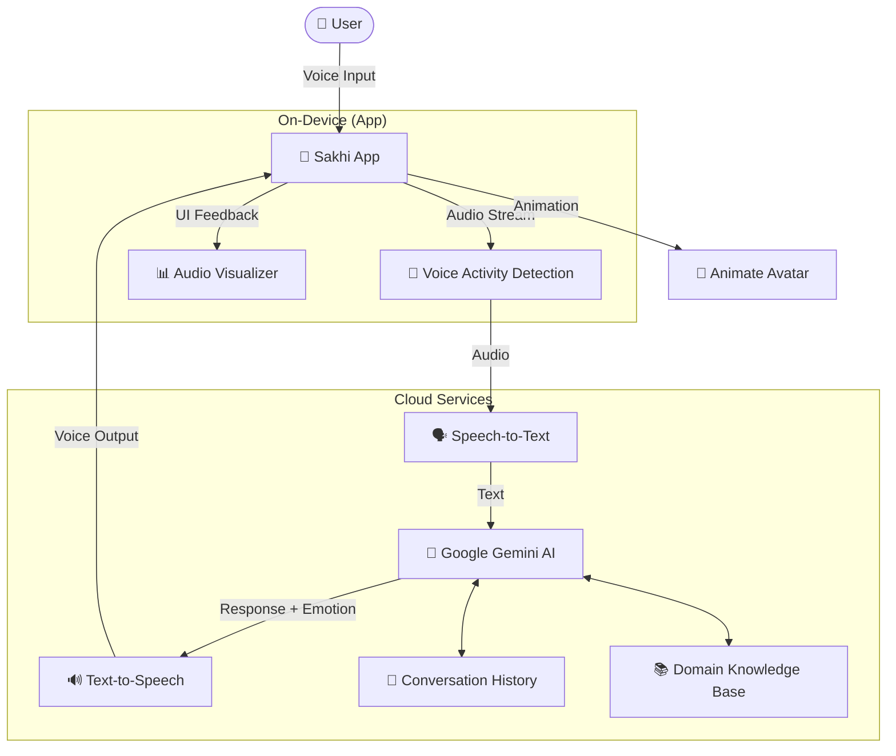
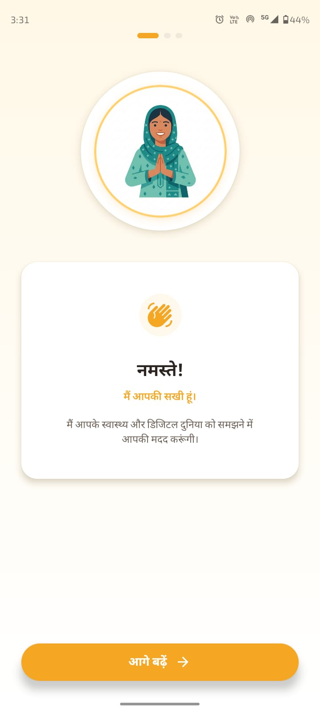
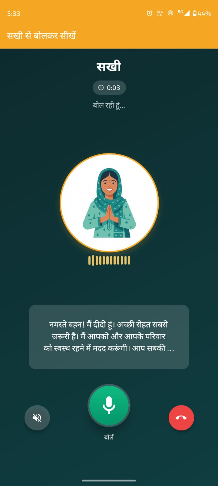
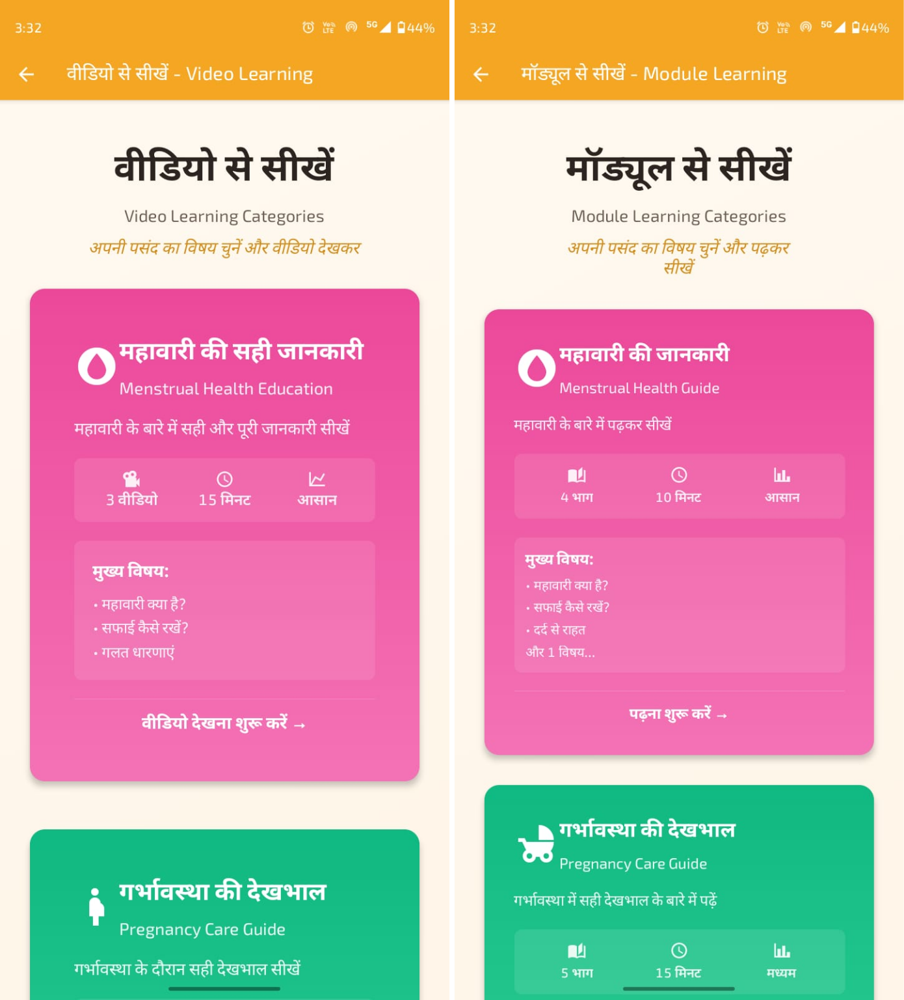

# 🌸 Sakhi | Your Digital Friend
> *Bridging the Digital Divide for Rural India through Voice-First AI*

[](https://reactnative.dev/)
[](https://expo.dev/)
[](https://deepmind.google/technologies/gemini/)
[](https://firebase.google.com/)

<div align="center">
  
  <br/>
  <h3><i>"One Button. One Voice. Infinite Possibilities."</i></h3>
</div>

---

## 🚨 The Challenge

In rural India, **300M+ women** own smartphones but cannot use them effectively due to:
*   ❌ **Literacy Barriers:** Inability to read text-heavy interfaces.
*   ❌ **Language Gaps:** Most apps are in English or formal Hindi.
*   ❌ **Tech Anxiety:** Fear of "pressing the wrong button" and losing money.

This results in a massive **Digital Divide**, excluding millions from the benefits of the digital economy, healthcare, and government schemes.

---

## 💡 The Solution: Sakhi

**Sakhi** (meaning "Female Friend") is a voice-first AI companion designed specifically for the next billion users. It completely reimagines the smartphone interface:

*   **No Typography Required:** Users interact purely through voice.
*   **Vernacular First:** Speaks local dialects (Hindi, Hinglish, and more).
*   **Empathetic AI:** Powered by **Google Gemini**, Sakhi listens, encourages, and teaches with the patience of a true friend.

---

## 🚀 Key Features

### 🗣️ Voice-Only Interface
Forget complex menus. Just press the **Big Green Button** and speak. Sakhi understands intent, context, and emotion.

### 🧠 Context-Aware AI Engine
Sakhi doesn't just answer; she *explains*.
*   *"What is UPI?"* → Explains like a friend.
*   *"How do I scan this?"* → Guides step-by-step.
*   *"I'm feeling sick"* → Suggests home remedies or nearby doctors (with disclaimers).

### 🎓 Interactive Learning Modules
Bite-sized, gamified lessons on essential life skills:
*   🏥 **Health:** Menstrual hygiene, pregnancy care, nutrition.
*   💰 **Finance:** UPI payments, savings, fraud prevention.
*   ⚖️ **Legal Rights:** Women's safety laws, FIR filing, government schemes.

### 🎨 Human-Centric Design
*   **Visuals:** Warm, relatable avatar ("Didi") that evolves with the conversation.
*   **Feedback:** Haptic vibrations and audio cues for every action.
*   **Simplicity:** Zero-scroll interfaces, high-contrast buttons.

---

## 🛠️ System Architecture

Sakhi is built on a robust, scalable architecture focusing on low-latency voice processing and offline resilience.



---

## 📸 Functionality Glimpses

| **The "Sakhi" Interface** | **Voice-First Learning** | **Interactive Modules** |
|:---:|:---:|:---:|
|  |  |  |
| *Simple, welcoming home screen* | *Real-time AI conversation* | *Visual learning cards* |

*(Note: Add screenshots to `assets/screenshots/` to see them here)*

---

## 💻 Tech Stack

*   **Frontend Framework:** React Native (Expo) - For rapid cross-platform development.
*   **Artificial Intelligence:** **Google Gemini 1.5 Flash** - For fast, multimodal, and reasoned responses.
*   **Voice Processing:**
    *   **STT:** Expo Speech Recognition / Google Cloud STT
    *   **TTS:** Expo Speech (System Voice)
*   **Backend & Auth:** Firebase (Authentication, Firestore, Analytics).
*   **Offline Storage:** AsyncStorage (for caching lessons and user progress).

---

## 🏃‍♀️ Getting Started

### Prerequisites
*   Node.js (v18+)
*   Expo CLI
*   Android/iOS Device with **Expo Go** app.

### Installation

1.  **Clone the Repository**
    ```bash
    git clone https://github.com/Aayu095/sakhi.git
    cd sakhi
    ```

2.  **Install Dependencies**
    ```bash
    npm install
    ```

3.  **Environment Setup**
    Create a `.env` file in the root directory:
    ```env
    EXPO_PUBLIC_GEMINI_API_KEY=your_gemini_api_key
    EXPO_PUBLIC_FIREBASE_API_KEY=your_firebase_key
    ```

4.  **Run the App**
    ```bash
    npx expo start
    ```
    *Scan the QR code with your phone.*

---

## 🗺️ Roadmap

*   **Phase 1: Foundation (Current)**
    *   ✅ Core Voice Architecture
    *   ✅ Basic Health & Finance Modules
    *   ✅ Gemini AI Integration

*   **Phase 2: Localization**
    *   🔄 Multilingual support (9 Indian languages)
    *   🔄 Offline NLP models

*   **Phase 3: Community**
    *   🤝 Peer-to-peer mentorship
    *   🛍️ Hyperlocal marketplace for women creators

---

## 📄 License

This project is licensed under the MIT License - see the [LICENSE](LICENSE) file for details.

---

<div align="center">
  <b>Built with ❤️ for Bharat 🇮🇳</b><br/>
  <i>Empowering women, one conversation at a time.</i>
</div>