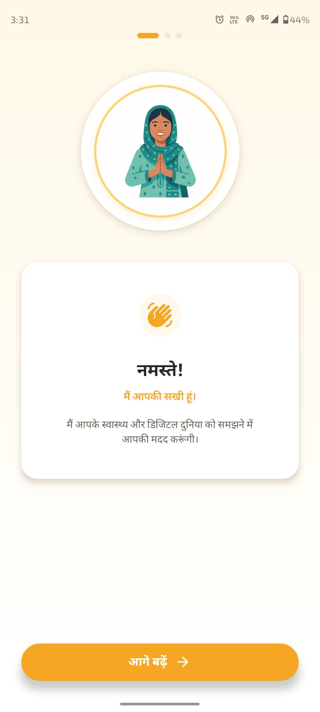
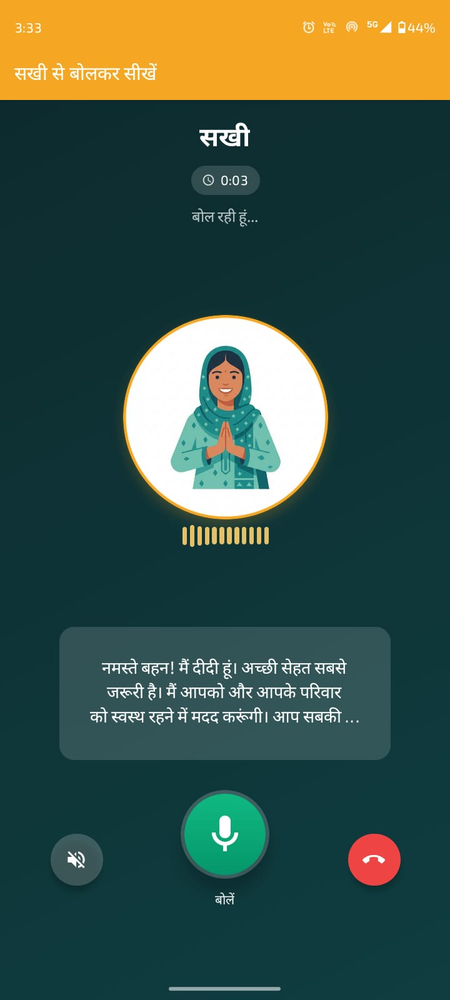
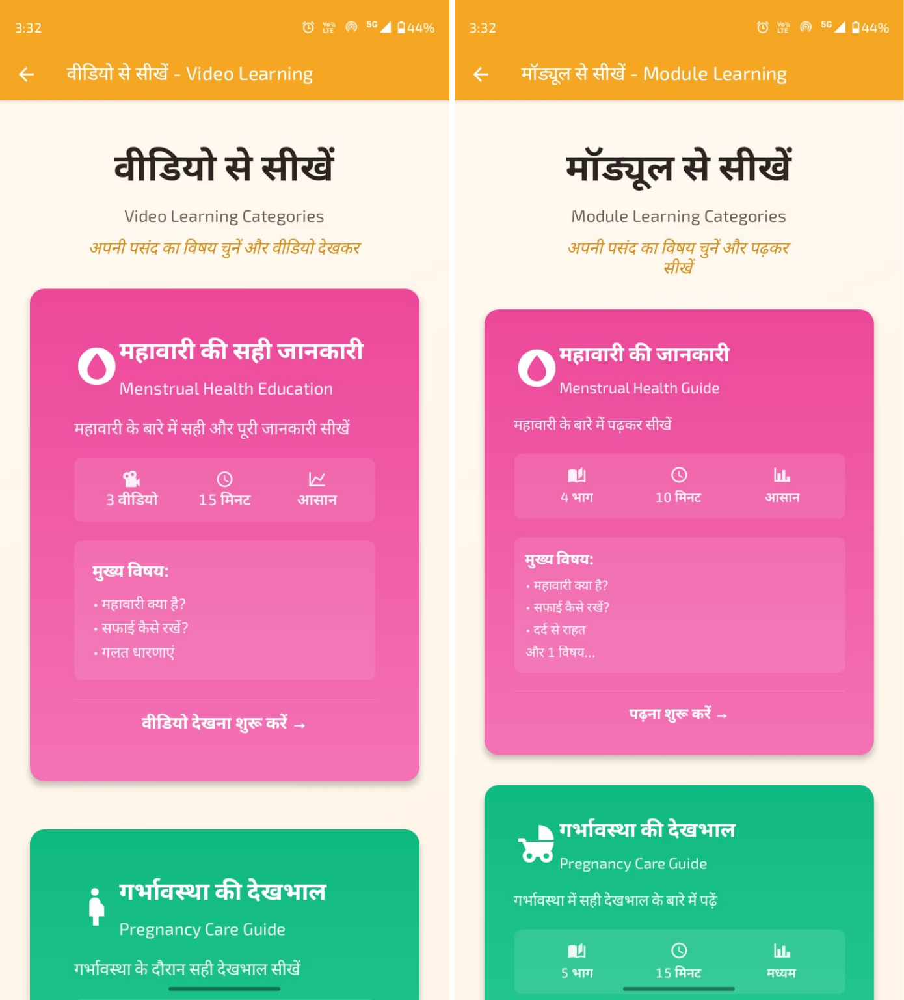

# Sakhi — Speak. Learn. Feel Confident.

<p align="center">
  
</p>

<p align="center">
  <strong>A Hindi-first, voice-guided learning companion that helps women build everyday digital confidence.</strong>
</p>

<p align="center">
  <a href="#why-sakhi">Why Sakhi</a> ·
  <a href="#what-judges-can-experience">Demo flow</a> ·
  <a href="#technology">Technology</a> ·
  <a href="#run-locally">Run locally</a>
</p>

---

## The idea in one line

**Sakhi turns intimidating digital tasks into a calm conversation with a trusted didi.**

Many people have a smartphone but still hesitate to use UPI, identify a scam, explore WhatsApp, or look up essential health and rights information. Sakhi is designed to make that first step feel safe: speak in Hindi/Hinglish, get a short and empathetic explanation, and learn one useful thing at a time.

## Why Sakhi?

Digital access is not the same as digital confidence.

For a first-time or low-confidence smartphone user, a small mistake can feel expensive: sharing an OTP, opening a suspicious link, or making an incorrect payment. Text-heavy apps, unfamiliar English, and fear of asking questions can make essential information feel out of reach.

Sakhi responds to that gap with a familiar interaction model:

- **Hindi-first and human in tone** — simple language, short answers, no technical jargon.
- **Voice-style learning** — users can speak when optional speech transcription is configured, or write when it is not.
- **Practical topics** — smartphone basics, digital payments, fraud awareness, health education, safety, and rights.
- **Learning without judgement** — guidance is framed like a patient conversation, not a lecture.

> Sakhi is an educational companion—not a doctor, lawyer, emergency service, bank, or replacement for professional support.

## What judges can experience

### 1. Start with a welcoming, Hindi-first journey
Create an account, complete onboarding, and enter a calm interface built with readable Devanagari typography and accessible controls.

### 2. Ask Sakhi a question
Open **“सखी से बोलकर सीखें”** and choose a topic such as digital literacy, financial safety, health, or rights.

- Tap the microphone to speak when cloud transcription is configured.
- Use **“लिखकर जवाब देना है?”** to open a focused text composer at any time.
- Sakhi keeps the latest exchange visible, so users can read an answer even after speech has finished.

### 3. Learn a safer digital habit
Explore focused learning and safety experiences for topics such as OTP protection and suspicious-link awareness. The app reinforces practical habits such as: **never share an OTP or PIN**.

### 4. Learn together
Use Community Learning to share stories, request help, offer support, and report inappropriate content. Community content is restricted to signed-in users through the included Firestore rules.

## Product highlights

| Experience | What Sakhi provides |
| --- | --- |
| **Voice-style conversation** | A responsive call surface with live call state, typed fallback, spoken output, latest-turn review, and a clear end-of-call summary. |
| **Digital confidence** | Simple guidance for smartphones, WhatsApp, UPI awareness, OTP safety, and suspicious links. |
| **Guided learning** | Video and read-and-learn routes for small, focused lessons instead of overwhelming information dumps. |
| **Safety-aware design** | Sensitive health, rights, and financial topics are presented as educational guidance with clear boundaries. |
| **Community Learning** | Signed-in users can create stories and help requests, offer help, and report content. |
| **Accessible by default** | Hindi-first Noto typography, clear tap targets, visible states, and an uncluttered mobile UI. |
| **Graceful fallback** | Optional cloud services can be unavailable without blocking the base flow: typed input, local topic guidance, and device speech keep the experience usable. |

## Screens

<p align="center">
  
  
  
</p>

## How it works

```text
User chooses a topic
        ↓
Speaks or writes in Hindi / Hinglish
        ↓
Sakhi gives concise, topic-aware guidance
        ↓
Answer is spoken on-device or through optional cloud speech
        ↓
User reviews the latest exchange and continues learning
```

### Resilient interaction model

Sakhi deliberately does not make the experience dependent on a single provider:

- **Default base flow:** local topic guidance, typed interaction, and on-device speech work without an AWS backend.
- **Optional cloud assistant:** API Gateway/Lambda chat and Polly can be enabled when a backend is available.
- **Optional cloud transcription:** microphone audio can be transcribed when a Gemini key is configured.
- **Clear fallback:** if transcription or microphone permission is unavailable, Sakhi switches to an explicitly labelled writing mode instead of pretending voice recognition worked.

## Technology

| Layer | Technology |
| --- | --- |
| Mobile client | React Native, Expo, React Navigation |
| Language & accessibility | Noto Sans Devanagari, Hindi-first UI, Expo Speech, Expo AV |
| Authentication | Firebase Authentication with email/password sign-in |
| User data & community | Cloud Firestore, Firebase rules, AsyncStorage profile cache |
| Optional assistant backend | Serverless Framework, AWS Lambda, API Gateway, Bedrock, Polly, Transcribe, DynamoDB, S3 |
| Optional transcription | Gemini generate-content API for audio transcription |
| UI feedback | Expo Haptics, Linear Gradients, vector icons, custom voice visualizer |

## Architecture

```text
                         ┌──────────────────────────┐
                         │       Sakhi mobile app    │
                         │   React Native + Expo     │
                         └─────────────┬────────────┘
                                       │
                ┌──────────────────────┼──────────────────────┐
                │                      │                      │
                ▼                      ▼                      ▼
       Firebase Auth +           Guided learning         Community Learning
       Firestore profile         + safety lessons        + Firestore rules
                │
                ▼
       Voice or typed question
                │
       ┌────────┴────────┐
       │                 │
       ▼                 ▼
Optional cloud STT     Typed fallback
       │                 │
       └────────┬────────┘
                ▼
 Optional cloud assistant ───────► Local topic fallback
                │                         │
                └────────────┬────────────┘
                             ▼
             Optional Polly / on-device speech
```

## Safety & trust principles

Sakhi is built around a few non-negotiable product choices:

1. **No false confidence:** unavailable speech recognition becomes a visible writing fallback.
2. **No professional impersonation:** health, legal, and financial content stays educational and encourages appropriate professional support when needed.
3. **Safer digital behavior:** scam-awareness lessons reinforce OTP/PIN and suspicious-link safety.
4. **Account-aware community:** Firestore rules scope user profiles to their owner and require authentication for Community Learning access.
5. **Optional cloud, useful base experience:** the app remains demonstrable without requiring an active AWS deployment.

## Run locally

### Prerequisites

- Node.js 18+
- npm
- Expo Go for Android/iOS **or** a modern browser for the web preview
- Firebase configuration for sign-in and profile/community features

### 1. Install dependencies

```bash
npm install
```

### 2. Add local environment values

Copy `.env.example` to `.env`, then add your Firebase values.

```bash
# macOS / Linux
cp .env.example .env

# Windows PowerShell
Copy-Item .env.example .env
```

The app can run its base voice-style experience without an AWS endpoint:

```env
EXPO_PUBLIC_ENABLE_CLOUD_ASSISTANT=false
```

### 3. Start Sakhi

```bash
npm start
# or
npm run web
npm run android
npm run ios
```

### Optional cloud services

The repository includes an optional Serverless backend. Enable it only after deploying/configuring your own backend:

```env
EXPO_PUBLIC_ENABLE_CLOUD_ASSISTANT=true
EXPO_PUBLIC_API_GATEWAY_URL=https://your-api-id.execute-api.your-region.amazonaws.com
```

To enable microphone transcription, configure a Gemini API key in `.env`:

```env
EXPO_PUBLIC_GEMINI_API_KEY=your_gemini_api_key
```

> `EXPO_PUBLIC_*` values are bundled into the client. Do not treat them as server-side secrets; use appropriately restricted keys and never commit `.env` files.

## Repository map

```text
Sakhi/
├── App.js                     # App routes, authentication gate, font loading
├── src/
│   ├── screens/               # Home, voice, lessons, community, profile, help
│   ├── components/            # Shared UI, avatar, visualizer, navigation
│   ├── services/              # Firebase, community, speech, assistant clients
│   ├── providers/             # Auth and profile state
│   └── config/                # Theme and optional service configuration
├── backend/                   # Optional Serverless/AWS implementation
├── assets/                    # Sakhi visuals and screenshots
├── firestore.rules            # Community and profile access rules
└── .env.example               # Required configuration template
```

## Future direction

- More regional-language experiences and local-language content review.
- Source-backed public-service information and stronger referral pathways.
- More guided practice for digital payments and scam recognition.
- Better privacy controls, consent, account-data management, and moderation workflows.

## License

Distributed under the [Apache License 2.0](./LICENSE).

---

<p align="center">
  <strong>Built to make the next tap feel less frightening—and the next skill feel possible.</strong>
</p>
